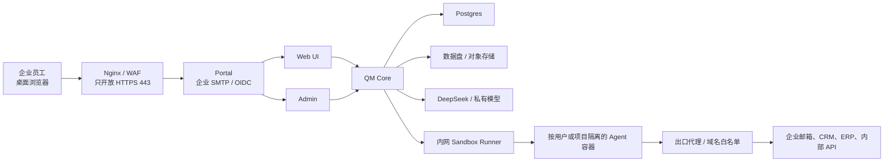

# QM 中国企业版开发计划

- 状态：执行中（M1 与 M1.5 已集成，生产形态在线验收待环境）
- 更新日期：2026-08-08
- 适用范围：metax2AI 基于 QM 构建的中国大陆企业 Agent 产品

## 1. 目标

在保留 QM 的 Agent、Memory、Files、Cron、审批和审计能力的基础上，形成一套适合中国大陆中小企业的独立部署产品。

产品应当满足以下结果：

- 运行时不依赖 Google、Slack、Fly.io 或 AWS 海外区。
- 首个模型使用 DeepSeek，后续能够接入客户私有模型。
- 员工可以通过桌面浏览器和企业邮箱登录并使用 Agent。
- Agent 可以分析企业文件、生成报告、草拟回复和执行定时任务。
- 模型生成的命令在受限、可审计的内网沙箱中运行。
- 企业可以逐步接入企业邮箱、CRM、ERP 和内部 API。
- 一个企业使用一套独立实例，企业数据和凭据不与其他企业混用。

## 2. 规划假设

- 首个版本面向单企业、单实例，不建设公共多租户 SaaS。
- **Web 桌面浏览器是唯一且长期的用户入口。飞书、企业微信和钉钉不在产品范围内**，这是范围决策，不是排期决策。
- **只保证桌面浏览器体验。** 移动端不作为验收条件；Web UI 现有的响应式实现与配套测试保持原样，既不新增投入，也不主动删除。
- **首个部署形态为国内公有云单机**：一台阿里云或腾讯云 ECS，使用 Docker Compose 运行全栈，复用 CLI 已有的 `docker` 部署目标。
- 第一版使用上传文件完成业务闭环，不等待企业系统连接器。
- 第一版的业务写操作只生成草稿，不自动发送邮件或修改生产系统。
- 企业演示只使用测试或脱敏数据；真实数据必须等安全 Sandbox Runner 和备份方案完成后再进入。
- 本计划使用相对工作量，不承诺日历工期。实际工期取决于团队规模、客户网络、模型方案和第三方应用审核。

## 3. 目标架构

控制面负责身份、权限、任务、审批和审计；Runner 负责模型生成命令的隔离执行。Core 不直接持有宿主机 Docker Socket。

## 4. 里程碑总览

| 里程碑                | 结果                                               | 相对工作量 | 产品阶段 |
| --------------------- | -------------------------------------------------- | ---------- | -------- |
| M0 基线与边界         | 明确验收场景、安全边界和技术决策                   | 小         | 准备     |
| M1 DeepSeek           | QM 可以原生运行真实 DeepSeek Agent                 | 中         | 演示     |
| M1.5 Web 中文本地化   | 登录后的 Web UI 提供完整简体中文体验并保留英文切换 | 中         | 演示     |
| M1.6 单入口界面收敛   | Web UI 不再暴露 Slack 与境外服务的残留概念         | 中         | 演示     |
| M2 Web MVP            | 文件分析、定时摘要、草稿和审计形成闭环             | 中         | 演示     |
| M3 On-prem Runner     | Agent 在国内云安全执行任务                         | 大         | 试点     |
| M3.5 构建供应链国产化 | 构建与镜像不依赖境外制品源                         | 小到中     | 试点     |
| M4 单机私有化部署     | 入口、数据、备份、制品和密钥达到试点要求           | 中到大     | 试点     |
| M5 企业邮箱           | 企业邮箱进入实际工作流                             | 中到大     | 扩展     |
| M6 生产加固           | 监控、灾备和企业运维体系                           | 大         | 生产     |

## 5. 分阶段开发计划

### M0：基线、场景与决策

建议分支：`codex/china-enterprise-baseline`

范围：

- 固定第一个演示场景：企业客户跟进与经营摘要助理。
- 准备不含真实客户信息的演示数据：客户跟进表、会议纪要、产品资料和企业制度。
- 明确第一家目标客户使用的网络环境。
- 确认模型方案：DeepSeek 公有 API 或客户私有模型。
- 确认企业邮箱类型。
- 记录允许的业务动作以及必须人工审批的动作。

验收标准：

- 演示流程、数据集、角色、输入和期望输出可以重复执行。
- 数据出境、网络出口和写操作边界得到明确确认。
- 未决定的事项记录为阻塞项，不在代码中静默假设。

当前状态（2026-08-08）：

- 演示场景与脱敏数据集已就位，见同目录 `demo-data/`。
- 网络形态、协作平台范围和 Web 端形态三项决策已确认，见第 10 节。

### M1：原生 DeepSeek 支持

建议分支：`codex/china-deepseek-provider`

范围：

- 在模型注册、运行时、凭据管理、Admin 和部署配置中增加 `deepseek` provider。
- 首批支持 `deepseek-v4-flash` 和 `deepseek-v4-pro`。
- 使用 `DEEPSEEK_API_KEY`，不通过 OpenRouter 中转。
- 默认模型优先选择 Flash；复杂任务可以切换 Pro。
- 验证工具调用、结构化输出、多轮推理、超时、限流和错误展示。
- 不在本阶段抽象所有 OpenAI-compatible 模型供应商。

验收标准：

- 管理员可以配置和检查 DeepSeek 凭据。
- Web 用户可以选择允许的 DeepSeek 模型并完成真实 Agent 对话。
- Agent 可以稳定调用至少一个本地工具并继续多轮对话。
- 密钥不会出现在日志、前端响应、Git 或错误详情中。
- 相关测试、类型检查和 lint 通过。

当前状态（2026-08-08）：

- `codex/china-deepseek-provider` 的原生 provider、Pi 运行时、模型目录、凭据、Admin、Web UI、CLI、部署配置和 Browse 子任务接入已经合入中国版集成分支。
- 自动化验证、类型检查、lint、格式检查和使用本地假 DeepSeek 服务的工具调用闭环已经完成。
- 真实 DeepSeek Key 与生产形态本地实例下的在线端到端验收仍待环境具备后执行；该环境验收必须在 M2 演示验收前完成，不再扩大 M1 的开发范围。

### M1.5：Web UI 中文本地化

建议上游分支：`codex/web-ui-localization`

范围：

- 使用 `@lit/localize` runtime mode 建立可持续的 i18n 基础，按需加载目标语言模块。英文作为源语言，首个目标语言和中国版部署默认语言统一为简体中文 `zh-Hans`；浏览器报告的 `zh`、`zh-CN` 和 `zh-SG` 归一到 `zh-Hans`。
- 语言优先级固定为浏览器本地保存的用户选择、部署默认语言、归一后的浏览器语言、英文回退。语言在首次渲染前加载，用户选择保存在 `localStorage`，不跨设备同步；首版切换语言可以刷新整个页面。
- 完整覆盖 Web UI 自身的静态标题、登录前状态、导航、会话、Composer、模型设置、审批、Projects、Files、Crons、Keychain、Apps、Memory、Skills、分屏和后台任务文案，避免首次渲染短暂显示英文。
- 使用 `Intl.DateTimeFormat`、`Intl.RelativeTimeFormat` 和 `Intl.NumberFormat` 本地化日期、相对时间、数字和数量表达。
- 翻译客户端生成的工具状态、审批、后台任务标签、服务端稳定状态枚举和已列入清单的稳定错误码；未知枚举回退为原值。高频接口只有通用错误码时，在 M1.5 中补充具体、稳定的错误码契约；未知服务端、模型和工具错误保留原始诊断信息，不通过匹配英文错误文本进行翻译。
- 正确设置页面 `lang`，并检查简体中文字体、换行、按钮宽度和无障碍标签。
- 通用 i18n 基础和 `zh-Hans` 语言包保持客户无关，适合时可独立提交上游；中国版仓库的 Web 运行时默认使用 `zh-Hans`，正式部署 layer 仍显式记录同一环境值。
- 增加语言选择、回退、翻译完整性、日期数字格式和关键页面渲染测试。所有抽取出的 `zh-Hans` 单元必须有非空译文；未包装的用户可见英文必须让检查失败，或进入经过人工审查的允许清单。

不在本阶段：

- 不翻译用户输入、项目名、文件名、Skill 内容、代码、命令、stdout/stderr、服务端不透明自由文本、原始诊断、工具生成内容或模型生成内容；这些原文与品牌名、模型名、provider 名、API 和配置标识共同构成受审查的中英混排例外。显示为 UI 语义的稳定枚举和状态不属于例外，必须经过语言目录映射。
- 不在本阶段强制 Agent 使用中文回复；模型回复语言作为独立的组织或用户偏好处理。
- 不同时完成 Admin、Portal、登录邮件、CLI 和部署文档的全量双语化。Portal、登录邮件和 M2 演示必需的 Admin 页面在 M2 中完成中文覆盖；低频 Admin、完整 CLI 和部署文档后续按实际需求推进。
- 不直接将现有英文硬替换为中文，也不维护两份独立 Web UI。

验收标准：

- 全新中国版部署进入 Web UI 应用时默认显示简体中文；Portal 和 Admin 是否已经中文化不作为 M1.5 的完成条件。
- 用户可以切换英文，刷新或重新登录后仍保留选择。
- Web UI 所有主要页面不出现未纳入允许清单的中英混杂；模型名、技术标识、用户数据以及服务端、工具和模型的不透明自由文本可以保留原文，稳定枚举和状态必须本地化。
- 日期、时间、数字、空状态、确认提示、审批和常见错误符合所选语言。
- API 路径、配置键和模型 ID 保持不变；错误码不随所选语言变化，译文不得写入错误码或持久化数据。
- Web UI 测试、类型检查和构建通过，并完成中英文桌面端关键路径截图验证。

当前状态（2026-08-08）：

- `codex/web-ui-localization` 的 Lit 本地化基础、简体中文语言包、部署默认语言、语言切换和关键错误反馈已经合入中国版集成分支。
- Web UI 全量测试、类型检查、本地化完整性检查和生产构建已经通过。
- 中国版 Web 服务的无配置运行时默认值和根、插件环境模板均已设置为 `zh-Hans`；M4 生成正式 layer 时，仍把同一非秘密环境值写入 `env.web-ui`。
- browser-only 生产形态实例已使用本地 PostgreSQL 启动并通过服务健康检查；中英文桌面端截图待补。移动端截图要求已随桌面端范围收窄一并移除。

### M1.6：单入口界面收敛

建议分支：`codex/web-only-surface`

新增里程碑。第 1 节承诺的「运行时不依赖 Slack」只覆盖到不连接 Slack 服务，不覆盖界面。Slack 在 Web UI 中是一等公民概念，其渲染路径不依赖 Slack 是否配置，因此在无 Slack 部署下仍然执行，留下一批无效控件和面向境外用户的文案。Web 成为唯一入口后，这些是演示时的第一印象。

前置事实：Slack 插件本身已经是配置驱动的，未提供 `SLACK_BOT_TOKEN` 与 `SLACK_APP_TOKEN` 时不会启动。本里程碑不删除 `src/slack/`，也不删除 core 中的 Slack 代码路径——保留它们是为了让上游同步保持可控，这批代码在中国版部署下处于休眠状态。本里程碑只处理**被实际执行的界面逻辑**。

范围：

- 新增 surface 能力开关。判定属于 core：Slack 既可能来自环境变量，也可能来自 Admin 侧安装，两处判定应由 `src/surfaces/slack-installation.ts` 的单一函数给出，Admin 路由与该开关共用。结果经 `/v1/directory/meta` 送到 Web 层——该端点已经在返回 Slack workspace 信息，且 web-ui 本就为每次 `/me` 请求它并缓存，因此不新增往返。前端从 `/me` 取值，以一个与 `can()` 并列的辅助函数统一读取，各渲染点据此决定是否渲染。
- 侧边栏「Web only」开关：`plugins/web-ui/src/sessions.ts` 的 `webOnly` 默认开启，控件在 `src/shell.ts`。无 IM 时该开关无论开关都不改变结果，应整体移除。
- Chats 页 Surface 下拉：`src/sessions.ts` 中包含 `slack` 选项，在无 Slack 部署下永远筛出空列表；只剩单一 surface 时整个下拉隐藏。
- 空态文案：`src/sessions.ts` 在列表非空时显示「Slack 对话已隐藏」，这在无 Slack 部署下是错误信息。
- `surfaceOf()`：`src/sessions.ts` 依据 `dm:` 与 `ch:` 前缀判定 Slack。core 的 threadRef 命名契约保持不动，仅 Web 侧不再据此渲染 Slack 分支。
- Slack 图标与样式：`src/sessions.ts` 的 `slackLogo()`、`src/connectors.ts` 中的第二份内联 SVG，以及 `src/shell.css` 的 `.surface-slack` 与 `.slack-logo`。
- `GET /me` 的既有往返：`server/index.ts` 每次都请求 core 的 `/v1/directory/meta` 取 Slack workspace 地址。该请求改为同时取回开关值，成为唯一的数据来源；注意只缓存成功结果，请求失败或字段缺失时不可断言「Slack 已关闭」，否则 core 重启或新旧版本错位期间会让 Slack 部署的界面塌掉。
- 欢迎语：`src/chat.ts` 的首次会话文案向用户推介 Slack、Google Workspace、GitHub 与 Linear，简体中文版同样点名。改为面向中国企业场景的能力描述。
- Portal 的身份提供方默认值：`plugins/portal/src/index.ts` 的 OIDC 端点默认指向 `slack.com`。这不是不会执行的死代码，而是一个陷阱——未设置 `OIDC_ISSUER` 时 issuer 静默变成 Slack，且 JWKS 校验恰好豁免 Slack issuer，于是一个漏配身份提供方的部署可以干净启动，再把用户送去境外登录。生产环境应要求显式声明 issuer（选用 Slack 也必须写出来），并加测试覆盖。

配套：`plugins/web-ui/test/localization-catalog.test.ts` 的未翻译允许清单中含 `Slack`，本批改动落地后应从清单移除。本地化完整性检查已挂在 web-ui `npm test` 的第一步，遗漏会直接失败。

经核实不属于缺陷，不做改动：

- **Connectors 页**。本计划早期版本认为它会罗列七个境内不可用的服务。实测不会：`src/connectors.ts` 在渲染前已把 provider 过滤为 available、connected 或 needsReconnect 三者之一，未配置 OAuth 凭据的 provider 根本不进列表，未配置任何连接器的部署显示的是「尚未配置任何账户提供方」空态。文件中的连接器名称与图标只是本地化查找表，不驱动渲染。
- **预算货币**。本计划早期版本认为 Web UI 的 `currency: "USD"` 是硬编码缺陷。实际上预算全链路以美元计价——`BUDGET_USD_PER_WINDOW`、`spentUsd`、`limitUsd` 直到 orchestrator 自己的提示文本。只改显示单位而不换算，等于把 25 美元谎报成 25 元。若客户要求人民币计价，那是 core 的货币支持议题，涉及配置项、字段命名与模型定价表，不属于界面收敛。

不在本阶段：

- 不删除 `src/slack/`、core 中的 Slack 代码路径或 Slack 相关测试。
- 不改动 core 的 `threadRef` 与 `scopeId` 命名契约。
- 不新增国产连接器。

验收标准：

- 在未配置 IM 的部署下，Web UI 不出现任何 Slack 字样、图标或相关控件。
- 界面中不存在筛选结果恒为空的选项，也不存在切换后无任何差异的开关。
- 欢迎语不向用户推介在中国大陆不可用的服务。
- Slack 仍然配置时，上述控件照常出现——本里程碑收敛的是渲染条件，不是删除功能。
- 生产环境下未显式声明 `OIDC_ISSUER` 的 Portal 拒绝启动，并有测试证明。
- `localize:check`、Web UI 全量测试、类型检查和生产构建通过，附中文桌面端截图。

当前状态（2026-08-08）：

- 实现已提交并开出评审：core 的共享判定与 `/v1/directory/meta` 字段、Web 侧各渲染点收敛、Portal 的显式 issuer 要求。
- 独立上下文评审发现一处真实缺陷并已修复：Admin 侧断开 Slack 写入的是墓碑记录而非删除记录，其状态为 `configured: false` 但 `managed: true`，判定若取 `managed` 会把「已断开」读成「已启用」。判定改取 `configured`，并补齐该组合的测试。
- 遗留一项：CLI 的 `validatePortalTrust` 仍把未设置的 `OIDC_ISSUER` 解析为 Slack 默认值，因此配置校验会放过一份 Portal 将拒绝启动的配置。对齐它需改动六个测试文件，其中一个测试的既有意图与之冲突，故另行处理。失败模式是一条清晰的启动错误，不是静默错配。
- 中英文桌面端截图已在本地 `--no-slack` 实例上取得，覆盖开关关闭与开启两种配置。

### M2：Web 企业 MVP

建议分支：`codex/china-mvp`

范围：

- 使用企业 SMTP 魔法链接或标准 OIDC 登录。
- 完成 Portal、登录邮件以及本阶段演示必需的 Admin Onboarding、模型、用户、任务、错误和审计页面的简体中文覆盖。
- 复用 QM Files 上传 PDF、Word、Excel、CSV 和会议资料。
- 建立「客户跟进与经营摘要」行业 Skill。
- 支持资料问答、来源引用、表格分析、待办提取和回复草稿。
- 使用 Cron 每天生成摘要，在 Web 内保留结果和执行记录。
- 管理员可以查看用户、任务、模型调用、错误和审计信息。
- 所有外部写操作保持关闭，或只生成等待人工确认的草稿。
- 本阶段只用现有 Local Sandbox 处理测试或脱敏数据，不把它描述为企业生产安全边界。

演示验收流程：

1. 员工使用企业邮箱登录。
2. 上传客户跟进表、会议纪要和产品资料。
3. 请求 Agent 列出当天最重要的客户并说明依据。
4. Agent 生成带来源的优先级、待办和客户回复草稿。
5. Cron 在约定时间生成经营摘要。
6. 管理员可以查到完整执行和审计记录。

验收标准：

- 上述流程可以在一套全新环境重复部署和演示。
- 演示运行时不访问 Google、Slack 或 Fly.io。
- Agent 输出错误时有可理解的用户提示和管理员记录。
- 前端变化具备真实数据截图，Agent 行为经过本地端到端验证。

### M3：On-prem Sandbox Runner

建议分支：`codex/onprem-sandbox-runner`

单机形态下 Runner 与 Core 部署在同一台 ECS 上，通过本机内网 API 通信。同机不降低隔离要求：Core 仍然不得持有宿主机 Docker Socket。

范围：

- 新增独立 Runner 服务，Runner 独占 Docker 或其他容器运行时。
- Core 通过带鉴权的内网 API 调用 Runner，不挂载 Docker Socket。
- Runner 实现现有 Sandbox 接口要求的创建、执行、文件、进程、销毁和备份能力。接口的必需成员约为九个，读写文件、目录与备份可复用 `src/sandbox/` 下既有的 exec 系列辅助实现，新实现主要承担容器创建、命令执行与销毁。
- 每个用户或项目使用独立容器、网络和持久卷。
- 强制 CPU、内存、PID、磁盘、超时和镜像 digest 限制。
- 默认拒绝网络出口，通过代理和域名白名单逐项放行。
- 在 Postgres 中持久记录 scope、runner、容器、卷、镜像和最后活动时间。
- 扩展部署配置，允许 Docker 使用 Runner，并取消对 Fly sandbox app 的要求。

必须处理的已知缺口：现有 `src/sandbox/local-sandbox.ts` 将 `egressEnforcement` 固定为 `none`。也就是说在当前 local 与 docker 后端下，`src/egress-authz-main.ts` 与 `src/resolution/egress-policy.ts` 这套出网授权机制并未生效。本里程碑的「未授权外网请求在网络层失败」必须由 Runner 自己的容器网络层实现，例如 iptables、强制 HTTP 代理或独立出口代理，不能假设可以继承现有机制。

可以复用的部分：出网策略的默认允许列表为空，没有硬编码的境外白名单需要清理，策略完全由运维在 Admin 侧配置。

验收标准：

- Core 无法直接访问 Docker Socket。
- 两个不同 scope 不能读取对方文件、进程、网络或凭据。
- 未授权外网请求在网络层失败，而不只是由模型拒绝。
- Runner 重启后能够恢复或安全重建已有 scope。
- 超时、资源耗尽和异常容器可以被回收并记录审计。
- 对容器逃逸面、路径穿越、凭据泄漏和出口绕过完成专项安全测试，并记录无法由测试证明的残余风险。

### M3.5：构建供应链国产化

建议分支：`codex/china-build-supply-chain`

从原 M4 中独立出来，因为它是构建阻塞而非部署优化：在国内网络环境的干净机器上，当前依赖装不完，后续里程碑都无法在目标环境验证。

范围：

- 根 `package.json` 的 `@earendil-works/pi-coding-agent` 指向 GitHub release 的 tarball 直链。npm registry 镜像对这类直链无效，必须预取到内网 registry 或受控对象存储后改写引用。
- 沙箱镜像构建期出网：`fly/Dockerfile` 使用 Debian apt 源、npm、PyPI 的 `browser-use`、GitHub release 的 `gh` CLI 和 amazonaws.com 的 awscli；`local/Dockerfile` 基于同一基础镜像因而继承全部依赖。前三项换国内镜像源，`gh` 改内网托管，awscli 在国内形态下建议直接移除。
- 注意 `src/sandbox/local-sandbox.ts` 的镜像指纹以 `fly/Dockerfile`、`local/Dockerfile` 和 `aws/microvm-agent/agent.mjs` 为输入，修改 Dockerfile 会触发指纹变化，需要同步验证沙箱复用与重建逻辑。

验收标准：

- 一台干净的国内云主机在无法访问 GitHub 的条件下，能够完成依赖安装与沙箱镜像构建。
- 构建产物可以推入企业镜像仓库并按 digest 部署。

### M4：单机私有化部署与数据保护

建议分支：`codex/china-deployment`

部署形态已确定为国内公有云单机，因此本阶段不再准备多形态部署模板。

范围：

- 只对外暴露 Portal 的 HTTPS 443；Core、Web、Admin、Auth、Postgres 和 Runner 留在私网。
- **不开发阿里云、腾讯云和华为云专属控制器。** CLI 已有的 `docker` 部署目标是完整实现，覆盖 Postgres 容器与数据卷、各服务容器、组织标签与网络，并且直接读取 `.env` 因而无需独立的密钥推送步骤。目标形态即为该实现加运维配置。
- 补齐本 layer 的部署脚手架。当前目录只有本计划文档与 `demo-data/`，缺少 `qm.config.jsonc`、`.env.example`、`sandbox/` 与 `deployment.md`。
- 支持企业 CA、Nginx、内部 DNS、代理和域名白名单。
- 使用外部或托管 Postgres 16，并完成连接、容量和故障测试。
- 对象存储：`src/persistence/s3.ts` 的客户端工厂目前不接受自定义 endpoint，也未提供 path-style 选项，补齐这两项即可打通 MinIO、OSS 与 COS，其余调用点无需改动。单机形态下也可先使用 `SNAPSHOT_STORE=local` 与 `TRANSFER_STORE=local`，二者已受支持。
- 邮件：设置 `AUTH_EMAIL_TRANSPORT=smtp` 即可接企业邮箱，`plugins/auth/src/smtp.ts` 是不依赖第三方库的原生实现且已有测试。注意该配置项的默认值是 `resend`，必须显式设置，否则生产环境会指向境外服务。
- 密钥：`src/credentials/secret-source.ts` 的环境变量实现可直接使用；`SecretSource` 接口保持干净，日后接入云厂商凭据管家只需新增一个实现。
- 建立 Postgres、Core 数据、Sandbox Volume、对象存储和密钥的备份清单。
- 建立恢复流程并完成一次真实恢复演练。
- 将所有第一方服务和 Sandbox 镜像推入企业镜像仓库。
- 生产密钥进入客户密钥系统或受控注入流程，不写入镜像和仓库。

验收标准：

- 关闭公网出口后，除白名单服务外系统仍可以正常工作。
- 外部扫描只能访问 Portal，无法访问内部服务端口。
- 从空服务器和备份能够恢复用户、会话、文件、Cron、审计和必要的 Agent 工作区。
- 镜像由受控 CI 构建和扫描，并能从客户制品库按 digest 部署。
- 升级前有数据快照，失败时具备明确的代码回退和数据恢复步骤。

### M5：企业邮箱接入

建议分支：`codex/enterprise-mail-gateway`

排在 M4 之后。第一版业务闭环依靠文件上传完成，邮箱是扩展能力而非 MVP 前置条件。

范围：

- 通过独立 Mail Gateway 支持共享业务邮箱的搜索、读取和草稿。
- SMTP 只负责最终发送，发送必须人工确认。
- 使用 IMAP Drafts 或厂商 API 保存草稿。
- 收件人白名单、附件限制、审计和凭据托管在服务端强制执行。

实现提示：`src/connectors/oauth.ts` 的 provider 表是数据驱动的，新增服务商只需补充授权与令牌端点及 scope 配置，不需要改动架构。这同样适用于日后接入国产 SaaS。

验收标准：

- 重复事件不会造成重复任务或重复发送。
- Agent 不直接持有企业邮箱长效管理凭据。
- 写操作必须经过服务端权限判断和人工审批。
- 连接器故障不会破坏 Web 主流程。

### M6：生产加固

建议分支：按单项风险拆分，不创建一个长期 `production` 大分支。

单企业单实例形态下，可用性目标以「快速恢复」为主，多副本不是第一优先级。

范围：

- Postgres 备份、PITR、连接池和容量告警。
- Runner 容量控制、故障恢复和持久调度。
- 对象存储版本控制、生命周期和恢复验证。
- 集中日志、指标、告警、成本和模型用量治理。
- 密钥轮换、用户离职、凭据撤销和企业级保留策略。
- 灾备演练、发布审批、镜像签名验证和安全扫描。
- 客户明确要求高可用时，再评估 Portal、Web 和 Core 多副本，以及实时流、OIDC 状态和调度状态的外置或粘性策略。

验收标准：

- 单个控制面实例或 Runner 故障不会造成不可恢复的数据丢失。
- 达到客户确认的 RPO、RTO、容量和可用性目标。
- 升级、回滚、备份和恢复都有可重复的运行手册。
- 完成独立安全评审和客户部署专项评审。

## 6. 企业可见功能随阶段变化

| 阶段 | 企业能够使用的功能                                           |
| ---- | ------------------------------------------------------------ |
| M1   | 使用 DeepSeek 与真实 Agent 对话                              |
| M1.5 | 桌面浏览器中的 Web UI 使用完整简体中文界面，并可切换回英文   |
| M1.6 | 界面只呈现本部署真实可用的能力，无境外服务残留               |
| M2   | 企业登录、资料上传、知识问答、表格分析、草稿、定时摘要、审计 |
| M3   | 安全执行 Python、Shell、文件处理和受限企业 API 调用          |
| M3.5 | 可在国内网络环境从零构建和部署                               |
| M4   | 国内云单机试点、备份恢复、私有镜像和数据保护                 |
| M5   | 企业邮箱读取与草稿、真实业务系统连接                         |
| M6   | 集中运维、灾备和生产服务等级                                 |

## 7. 分支与交付规则

- 中国版仓库的 `main` 是唯一长期稳定分支，只保存已经验证的中国版能力。
- 每个里程碑或高风险能力使用独立短分支，验证后通过 PR 合入中国版 `main`，不保留互相漂移的长期里程碑分支。
- 中国版可以修改 Core；修改应保持客户无关、范围清晰并有测试，客户名称、地址、凭据和业务配置只进入 `deploy/layers/<org>/`。
- 同步上游先在临时集成分支 merge `upstream/main`，解决冲突并验证后再通过 PR 合入中国版 `main`；不使用 rebase 改写历史。
- 保留上游代码优先于删除。产品不使用的上游能力通过配置关闭并在界面层收敛，不从代码库移除，以免每次上游同步都产生大范围冲突。
- 适合公共 QM 的修复可以另行贡献上游，但不得泄露中国版仓库、客户或部署信息。
- 每个 PR 只解决一个清晰目标，并列出验收证据和剩余风险。
- 任何 Core、认证、凭据、执行、网络、数据或审批变更都必须由未参与实现的独立上下文审查。
- 受影响测试、类型检查和 lint 在本地执行；完整测试交给 CI。
- Agent 行为和 Web 变化必须进行真实本地实例验证；用户可见变化附桌面端截图。

## 8. 跨阶段安全规则

- 未完成 M3 前不使用真实敏感数据。
- Agent、文档、邮件、网页和连接器返回内容一律视为不可信输入。
- 人工审批是业务控制，不是沙箱或网络安全边界。
- Sandbox 默认无网络；每个出口必须有明确业务目的、域名和审计。
- 生产写操作通过类型化服务端工具执行，不向 Agent 提供数据库管理员凭据。
- 任何秘密不得进入 Git、日志、截图、聊天记录或构建产物。
- 模型供应商会接收发送给模型的内容；客户必须在使用公有模型前确认数据范围。
- 备份必须同时覆盖数据和解密密钥，并定期验证恢复。

## 9. 首个可销售 MVP 的完成定义

满足以下条件时，可以将产品作为受控企业 MVP 展示：

- 企业员工能够通过桌面浏览器和企业邮箱登录。
- DeepSeek 可以稳定完成文件问答、Excel 分析和内容生成。
- 回答能说明使用了哪些企业资料。
- Agent 可以生成待办、经营摘要和客户回复草稿。
- Cron 可以定时执行并保留历史记录。
- 界面中不出现本部署不具备的能力入口。
- 不发生未经人工确认的外部发送或业务数据修改。
- 管理员可以查看用户、任务、错误、模型使用和审计记录。
- 系统可以在中国大陆网络环境下运行，不依赖 Google、Slack 或 Fly.io。
- 部署、升级、备份和故障恢复都有可重复步骤。
- 使用真实客户数据前已完成 M3 和 M4 的安全验收。

## 10. 决策记录与待确认事项

已确认（2026-08-08）：

- 部署形态为国内公有云单机，使用一台 ECS 与 Docker Compose，复用 CLI 的 `docker` 目标。
- 不做飞书、企业微信和钉钉。Web 是唯一且长期的用户入口。
- Web 端只保证桌面浏览器体验，移动端不作为验收条件。

仍需确认，会改变后续设计和工期：

- 使用 DeepSeek 公有 API、国内云模型服务还是客户私有模型。
- 客户邮箱是标准 IMAP/SMTP、Exchange、Coremail 还是其他厂商。
- 永久文件使用本地盘、MinIO、OSS、COS 或其他对象存储。
- 客户要求的 RPO、RTO、保留周期和审计周期。
- 是否需要等保、行业合规或客户专项安全测评。

## 11. 建议的下一步

1. 在具备真实 DeepSeek 凭据后补充 M1 在线端到端验收。
2. 完成 M1.5 生产形态实例验收与中英文桌面端截图。
3. 执行 M1.6，使界面与「Web 单入口、无境外服务」的产品定位一致。
4. 使用脱敏数据完成 M2 的 Web 演示闭环。
5. 在接入真实客户数据前完成 M3 Runner、M3.5 构建供应链与 M4 单机私有化部署。
