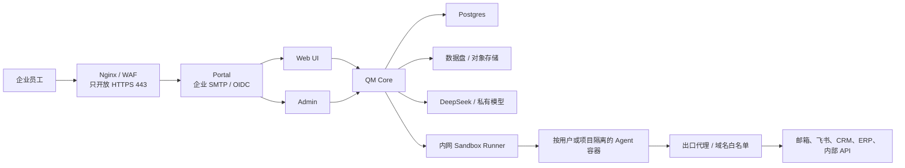

# QM 中国企业版开发计划

- 状态：执行中（M1 与 M1.5 已集成，生产形态在线验收待环境）
- 更新日期：2026-08-05
- 适用范围：metax2AI 基于 QM 构建的中国大陆企业 Agent 产品

## 1. 目标

在保留 QM 的 Agent、Memory、Files、Cron、审批和审计能力的基础上，形成一套适合中国大陆中小企业的独立部署产品。

产品应当满足以下结果：

- 运行时不依赖 Google、Slack、Fly.io 或 AWS 海外区。
- 首个模型使用 DeepSeek，后续能够接入客户私有模型。
- 员工可以通过 Web 和企业邮箱登录并使用 Agent。
- Agent 可以分析企业文件、生成报告、草拟回复和执行定时任务。
- 模型生成的命令在受限、可审计的内网沙箱中运行。
- 企业可以逐步接入飞书、企业邮箱、CRM、ERP 和内部 API。
- 一个企业使用一套独立实例，企业数据和凭据不与其他企业混用。

## 2. 规划假设

- 首个版本面向单企业、单实例，不建设公共多租户 SaaS。
- Web 是首要入口；飞书、企业微信和钉钉不同时开发。
- 第一版使用上传文件完成业务闭环，不等待企业系统连接器。
- 第一版的业务写操作只生成草稿，不自动发送邮件或修改生产系统。
- 企业演示只使用测试或脱敏数据；真实数据必须等安全 Sandbox Runner 和备份方案完成后再进入。
- 本计划使用相对工作量，不承诺日历工期。实际工期取决于团队规模、客户网络、模型方案和第三方应用审核。

## 3. 目标架构

控制面负责身份、权限、任务、审批和审计；Runner 负责模型生成命令的隔离执行。Core 不直接持有宿主机 Docker Socket。

## 4. 里程碑总览

| 里程碑              | 结果                                               | 相对工作量 | 产品阶段 |
| ------------------- | -------------------------------------------------- | ---------- | -------- |
| M0 基线与边界       | 明确验收场景、安全边界和技术决策                   | 小         | 准备     |
| M1 DeepSeek         | QM 可以原生运行真实 DeepSeek Agent                 | 中         | 演示     |
| M1.5 Web 中文本地化 | 登录后的 Web UI 提供完整简体中文体验并保留英文切换 | 中         | 演示     |
| M2 Web MVP          | 文件分析、定时摘要、草稿和审计形成闭环             | 中         | 演示     |
| M3 On-prem Runner   | Agent 在国内云或客户内网安全执行任务               | 大         | 试点     |
| M4 私有化部署       | 入口、数据、备份、制品和密钥达到试点要求           | 大         | 试点     |
| M5 国内连接器       | 飞书和企业邮箱进入实际工作流                       | 每项中到大 | 扩展     |
| M6 生产加固         | 高可用、监控、灾备和企业运维体系                   | 大         | 生产     |

## 5. 分阶段开发计划

### M0：基线、场景与决策

建议分支：`codex/china-enterprise-baseline`

范围：

- 固定第一个演示场景：企业客户跟进与经营摘要助理。
- 准备不含真实客户信息的演示数据：客户跟进表、会议纪要、产品资料和企业制度。
- 明确第一家目标客户使用的网络环境：国内云、受限内网或完全离线。
- 确认模型方案：DeepSeek 公有 API 或客户私有模型。
- 确认首个协作平台和企业邮箱类型。
- 记录允许的业务动作以及必须人工审批的动作。

验收标准：

- 演示流程、数据集、角色、输入和期望输出可以重复执行。
- 数据出境、网络出口和写操作边界得到明确确认。
- 未决定的事项记录为阻塞项，不在代码中静默假设。

### M1：原生 DeepSeek 支持

建议分支：`codex/china-deepseek-provider`

范围：

- 在模型注册、运行时、凭据管理、Admin 和部署配置中增加 `deepseek` provider。
- 首批支持 `deepseek-v4-flash` 和 `deepseek-v4-pro`。
- 使用 `DEEPSEEK_API_KEY`，不通过 OpenRouter 中转。
- 默认模型优先选择 Flash；复杂任务可以切换 Pro。
- 验证工具调用、结构化输出、多轮推理、超时、限流和错误展示。
- 不在本阶段抽象所有 OpenAI-compatible 模型供应商。

验收标准：

- 管理员可以配置和检查 DeepSeek 凭据。
- Web 用户可以选择允许的 DeepSeek 模型并完成真实 Agent 对话。
- Agent 可以稳定调用至少一个本地工具并继续多轮对话。
- 密钥不会出现在日志、前端响应、Git 或错误详情中。
- 相关测试、类型检查和 lint 通过。

当前状态（2026-08-05）：

- `codex/china-deepseek-provider` 的原生 provider、Pi 运行时、模型目录、凭据、Admin、Web UI、CLI、部署配置和 Browse 子任务接入已经合入中国版集成分支。
- 自动化验证、类型检查、lint、格式检查和使用本地假 DeepSeek 服务的工具调用闭环已经完成。
- 真实 DeepSeek Key 与生产形态本地实例下的在线端到端验收仍待环境具备后执行；该环境验收必须在 M2 演示验收前完成，不再扩大 M1 的开发范围。

### M1.5：Web UI 中文本地化

建议上游分支：`codex/web-ui-localization`

预计工作量：一名熟悉 QM Web UI 的工程师约 6–9 个工程日。

范围：

- 使用 `@lit/localize` runtime mode 建立可持续的 i18n 基础，按需加载目标语言模块。英文作为源语言，首个目标语言和中国版部署默认语言统一为简体中文 `zh-Hans`；浏览器报告的 `zh`、`zh-CN` 和 `zh-SG` 归一到 `zh-Hans`。
- 语言优先级固定为浏览器本地保存的用户选择、部署默认语言、归一后的浏览器语言、英文回退。语言在首次渲染前加载，用户选择保存在 `localStorage`，不跨设备同步；首版切换语言可以刷新整个页面。
- 完整覆盖 Web UI 自身的静态标题、登录前状态、导航、会话、Composer、模型设置、审批、Projects、Files、Crons、Keychain、Apps、Memory、Skills、分屏和后台任务文案，避免首次渲染短暂显示英文。
- 使用 `Intl.DateTimeFormat`、`Intl.RelativeTimeFormat` 和 `Intl.NumberFormat` 本地化日期、相对时间、数字和数量表达。
- 翻译客户端生成的工具状态、审批、后台任务标签、服务端稳定状态枚举和已列入清单的稳定错误码；未知枚举回退为原值。高频接口只有通用错误码时，在 M1.5 中补充具体、稳定的错误码契约；未知服务端、模型和工具错误保留原始诊断信息，不通过匹配英文错误文本进行翻译。
- 正确设置页面 `lang`，并检查简体中文字体、换行、按钮宽度、移动端布局和无障碍标签。
- 通用 i18n 基础和 `zh-Hans` 语言包作为客户无关的 Core 改动提交上游；只有 metax2AI 的部署默认语言配置进入 `deploy/layers/metax2ai/`。
- 增加语言选择、回退、翻译完整性、日期数字格式和关键页面渲染测试。所有抽取出的 `zh-Hans` 单元必须有非空译文；未包装的用户可见英文必须让检查失败，或进入经过人工审查的允许清单。

不在本阶段：

- 不翻译用户输入、项目名、文件名、Skill 内容、代码、命令、stdout/stderr、服务端不透明自由文本、原始诊断、工具生成内容或模型生成内容；这些原文与品牌名、模型名、provider 名、API 和配置标识共同构成受审查的中英混排例外。显示为 UI 语义的稳定枚举和状态不属于例外，必须经过语言目录映射。
- 不在本阶段强制 Agent 使用中文回复；模型回复语言作为独立的组织或用户偏好处理。
- 不同时完成 Admin、Portal、登录邮件、CLI、部署文档和 Slack 文案的全量双语化。Portal、登录邮件和 M2 演示必需的 Admin 页面在 M2 中完成中文覆盖；低频 Admin、完整 CLI、部署文档和 Slack 文案后续按实际需求推进。
- 不直接将现有英文硬替换为中文，也不维护两份独立 Web UI。

验收标准：

- 全新中国版部署进入 Web UI 应用时默认显示简体中文；Portal 和 Admin 是否已经中文化不作为 M1.5 的完成条件。
- 用户可以切换英文，刷新或重新登录后仍保留选择。
- Web UI 所有主要页面不出现未纳入允许清单的中英混杂；模型名、技术标识、用户数据以及服务端、工具和模型的不透明自由文本可以保留原文，稳定枚举和状态必须本地化。
- 日期、时间、数字、空状态、确认提示、审批和常见错误符合所选语言。
- API 路径、配置键和模型 ID 保持不变；错误码不随所选语言变化，译文不得写入错误码或持久化数据。
- Web UI 测试、类型检查和构建通过，并完成中英文桌面端与移动端关键路径截图验证。

当前状态（2026-08-05）：

- `codex/web-ui-localization` 的 Lit 本地化基础、简体中文语言包、部署默认语言、语言切换和关键错误反馈已经合入中国版集成分支。
- Web UI 全量测试、类型检查、本地化完整性检查和生产构建已经通过。
- 中英文桌面端与移动端的生产形态实例截图仍待本机 Slack 开发应用池和 Docker 环境具备后完成。

### M2：Web 企业 MVP

建议分支：`codex/china-mvp`

范围：

- 使用企业 SMTP 魔法链接或标准 OIDC 登录。
- 完成 Portal、登录邮件以及本阶段演示必需的 Admin Onboarding、模型、用户、任务、错误和审计页面的简体中文覆盖。
- 复用 QM Files 上传 PDF、Word、Excel、CSV 和会议资料。
- 建立“客户跟进与经营摘要”行业 Skill。
- 支持资料问答、来源引用、表格分析、待办提取和回复草稿。
- 使用 Cron 每天生成摘要，在 Web 内保留结果和执行记录。
- 管理员可以查看用户、任务、模型调用、错误和审计信息。
- 所有外部写操作保持关闭，或只生成等待人工确认的草稿。
- 本阶段只用现有 Local Sandbox 处理测试或脱敏数据，不把它描述为企业生产安全边界。

演示验收流程：

1. 员工使用企业邮箱登录。
2. 上传客户跟进表、会议纪要和产品资料。
3. 请求 Agent 列出当天最重要的客户并说明依据。
4. Agent 生成带来源的优先级、待办和客户回复草稿。
5. Cron 在约定时间生成经营摘要。
6. 管理员可以查到完整执行和审计记录。

验收标准：

- 上述流程可以在一套全新环境重复部署和演示。
- 演示运行时不访问 Google、Slack 或 Fly.io。
- Agent 输出错误时有可理解的用户提示和管理员记录。
- 前端变化具备真实数据截图，Agent 行为经过本地端到端验证。

### M3：On-prem Sandbox Runner

建议分支：`codex/onprem-sandbox-runner`

范围：

- 新增独立 Runner 服务，Runner 独占 Docker 或其他容器运行时。
- Core 通过带鉴权的内网 API 调用 Runner，不挂载 Docker Socket。
- Runner 实现现有 Sandbox 接口要求的创建、执行、文件、进程、销毁和备份能力。
- 每个用户或项目使用独立容器、网络和持久卷。
- 强制 CPU、内存、PID、磁盘、超时和镜像 digest 限制。
- 默认拒绝网络出口，通过代理和域名白名单逐项放行。
- 在 Postgres 中持久记录 scope、runner、容器、卷、镜像和最后活动时间。
- 扩展部署配置，允许 Docker 使用 Runner，并取消对 Fly sandbox app 的要求。

验收标准：

- Core 无法直接访问 Docker Socket。
- 两个不同 scope 不能读取对方文件、进程、网络或凭据。
- 未授权外网请求在网络层失败，而不只是由模型拒绝。
- Runner 重启后能够恢复或安全重建已有 scope。
- 超时、资源耗尽和异常容器可以被回收并记录审计。
- 对容器逃逸面、路径穿越、凭据泄漏和出口绕过完成专项安全测试，并记录无法由测试证明的残余风险。

### M4：国内私有化部署与数据保护

建议分支：`codex/china-deployment`

范围：

- 只对外暴露 Portal 的 HTTPS 443；Core、Web、Admin、Auth、Postgres 和 Runner 留在私网。
- 提供国内云和客户内网部署模板，首版不开发阿里云、腾讯云和华为云专属控制器。
- 支持企业 CA、Nginx/Ingress、内部 DNS、代理和域名白名单。
- 使用外部或托管 Postgres 16，并完成连接、容量和故障测试。
- 为 MinIO、OSS、COS 等补充可配置 S3 endpoint 和兼容性验证。
- 建立 Postgres、Core 数据、Sandbox Volume、对象存储和密钥的备份清单。
- 建立恢复流程并完成一次真实恢复演练。
- 将所有第一方服务和 Sandbox 镜像推入企业 Harbor、ACR、TCR 或 SWR。
- 构建阶段使用受控制品源；运行节点不直接依赖 GitHub、npm、PyPI 或 Docker Hub。
- 生产密钥进入客户密钥系统或受控注入流程，不写入镜像和仓库。

验收标准：

- 关闭公网出口后，除白名单服务外系统仍可以正常工作。
- 外部扫描只能访问 Portal，无法访问内部服务端口。
- 从空服务器和备份能够恢复用户、会话、文件、Cron、审计和必要的 Agent 工作区。
- 镜像由受控 CI 构建和扫描，并能从客户制品库按 digest 部署。
- 升级前有数据快照，失败时具备明确的代码回退和数据恢复步骤。

### M5：国内协作与业务连接器

建议分支：

- `codex/feishu-connector`
- `codex/enterprise-mail-gateway`
- 其他连接器按真实客户需求单独创建分支

飞书首版范围：

- 单聊、群内 `@`、文本回复和定时摘要推送。
- 事件验签、幂等、用户映射、会话映射和发送审计。
- 优先使用长连接，减少客户公网回调要求。
- 文件、审批卡片、历史搜索和云文档连接器放到后续版本。

企业邮箱首版范围：

- 通过独立 Mail Gateway 支持共享业务邮箱的搜索、读取和草稿。
- SMTP 只负责最终发送，发送必须人工确认。
- 使用 IMAP Drafts 或厂商 API 保存草稿。
- 收件人白名单、附件限制、审计和凭据托管在服务端强制执行。

验收标准：

- 重复事件不会造成重复任务或重复发送。
- Agent 不直接持有飞书应用密钥或企业邮箱长效管理凭据。
- 写操作必须经过服务端权限判断和人工审批。
- 连接器故障不会破坏 Web 主流程。

### M6：生产加固与高可用

建议分支：按单项风险拆分，不创建一个长期 `production` 大分支。

范围：

- Portal、Web 和 Core 多副本以及负载均衡连接排空。
- 将不适合多副本的实时流、OIDC 状态和调度状态外置或建立明确的粘性策略。
- Postgres 高可用、PITR、连接池和容量告警。
- Runner 节点池、持久调度、故障迁移和容量控制。
- 对象存储版本控制、生命周期和恢复验证。
- 集中日志、指标、告警、成本和模型用量治理。
- 密钥轮换、用户离职、凭据撤销和企业级保留策略。
- 灾备演练、发布审批、镜像签名验证和安全扫描。

验收标准：

- 单个控制面实例或 Runner 故障不会造成不可恢复的数据丢失。
- 达到客户确认的 RPO、RTO、容量和可用性目标。
- 升级、回滚、备份和恢复都有可重复的运行手册。
- 完成独立安全评审和客户部署专项评审。

## 6. 企业可见功能随阶段变化

| 阶段 | 企业能够使用的功能                                           |
| ---- | ------------------------------------------------------------ |
| M1   | 使用 DeepSeek 与真实 Agent 对话                              |
| M1.5 | 登录后的 Web UI 使用完整简体中文界面，并可切换回英文         |
| M2   | 企业登录、资料上传、知识问答、表格分析、草稿、定时摘要、审计 |
| M3   | 安全执行 Python、Shell、文件处理和受限企业 API 调用          |
| M4   | 国内云或客户内网试点、备份恢复、私有镜像和数据保护           |
| M5   | 飞书交互、企业邮箱读取与草稿、真实业务系统连接               |
| M6   | 高可用、集中运维、灾备和生产服务等级                         |

## 7. 分支与交付规则

- 中国版仓库的 `main` 是唯一长期稳定分支，只保存已经验证的中国版能力。
- 每个里程碑或高风险能力使用独立短分支，验证后通过 PR 合入中国版 `main`，不保留互相漂移的长期里程碑分支。
- 中国版可以修改 Core；修改应保持客户无关、范围清晰并有测试，客户名称、地址、凭据和业务配置只进入 `deploy/layers/<org>/`。
- 同步上游先在临时集成分支 merge `upstream/main`，解决冲突并验证后再通过 PR 合入中国版 `main`；不使用 rebase 改写历史。
- 适合公共 QM 的修复可以另行贡献上游，但不得泄露中国版仓库、客户或部署信息。
- 每个 PR 只解决一个清晰目标，并列出验收证据和剩余风险。
- 任何 Core、认证、凭据、执行、网络、数据或审批变更都必须由未参与实现的独立上下文审查。
- 受影响测试、类型检查和 lint 在本地执行；完整测试交给 CI。
- Agent 行为和 Web 变化必须进行真实本地实例验证；用户可见变化附截图。

## 8. 跨阶段安全规则

- 未完成 M3 前不使用真实敏感数据。
- Agent、文档、邮件、网页和连接器返回内容一律视为不可信输入。
- 人工审批是业务控制，不是沙箱或网络安全边界。
- Sandbox 默认无网络；每个出口必须有明确业务目的、域名和审计。
- 生产写操作通过类型化服务端工具执行，不向 Agent 提供数据库管理员凭据。
- 任何秘密不得进入 Git、日志、截图、聊天记录或构建产物。
- 模型供应商会接收发送给模型的内容；客户必须在使用公有模型前确认数据范围。
- 备份必须同时覆盖数据和解密密钥，并定期验证恢复。

## 9. 首个可销售 MVP 的完成定义

满足以下条件时，可以将产品作为受控企业 MVP 展示：

- 企业员工能够通过 Web 和企业邮箱登录。
- DeepSeek 可以稳定完成文件问答、Excel 分析和内容生成。
- 回答能说明使用了哪些企业资料。
- Agent 可以生成待办、经营摘要和客户回复草稿。
- Cron 可以定时执行并保留历史记录。
- 不发生未经人工确认的外部发送或业务数据修改。
- 管理员可以查看用户、任务、错误、模型使用和审计记录。
- 系统可以在中国大陆网络环境下运行，不依赖 Google、Slack 或 Fly.io。
- 部署、升级、备份和故障恢复都有可重复步骤。
- 使用真实客户数据前已完成 M3 和 M4 的安全验收。

## 10. 待确认决策

以下事项会改变后续设计和工期，应在对应里程碑启动前确认：

- 首个客户是国内云、受限内网还是完全离线。
- 使用 DeepSeek 公有 API、国内云模型服务还是客户私有模型。
- 第一个协作平台是飞书、企业微信还是钉钉。
- 客户邮箱是标准 IMAP/SMTP、Exchange、Coremail 还是其他厂商。
- 永久文件使用本地盘、MinIO、OSS、COS 或其他对象存储。
- 客户要求的 RPO、RTO、保留周期和审计周期。
- 是否需要等保、行业合规或客户专项安全测评。

## 11. 建议的下一步

1. 评审并确认本计划的假设和首个演示场景。
2. 在具备真实 DeepSeek 凭据后补充 M1 在线端到端验收。
3. 在具备 Slack 开发应用池和 Docker 后完成 M1.5 生产形态实例验收与中英文桌面端、移动端截图。
4. 使用脱敏数据完成 M2 的 Web 演示闭环。
5. 在接入真实客户系统前完成 M3 Runner 和 M4 私有化部署。
